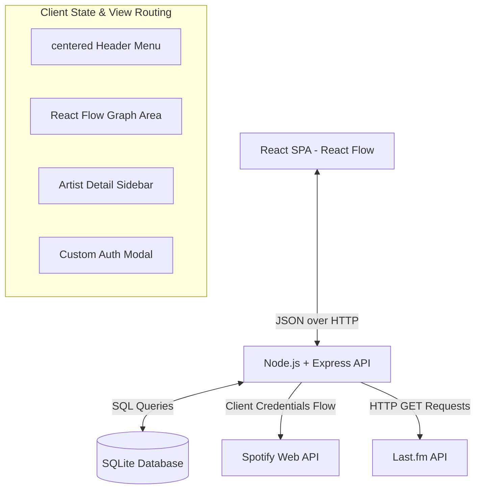
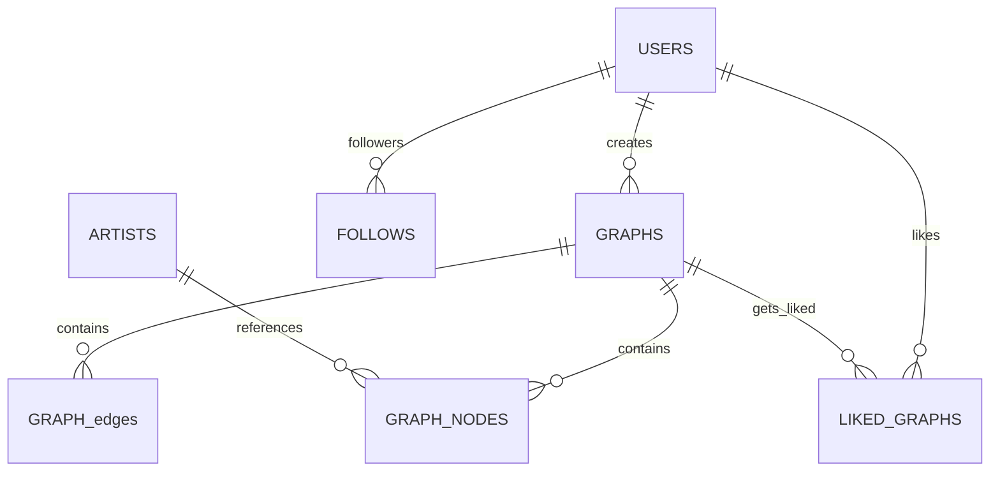

# Music Discovery Map - Technical Architecture & Reference

This document provides a detailed technical breakdown of the system architecture, database design, caching layers, external API integrations, and frontend state management.

---

## 1. System Architecture

The application is built on a decoupled client-server architecture:

- **Frontend**: A Single Page Application (SPA) built using React. It leverages **React Flow** to render interactive canvas topologies and uses **Tailwind CSS** for layout styling and transitions.
- **Backend**: A RESTful Express server built with Node.js. It acts as the API Gateway, handling request validation, caching logic, database query operations, session verification, and upstream API fetches.
- **Database Layer**: A local SQLite database file (`music_discovery.db`) initialized automatically on server boot, serving as the relational store.

---

## 2. Database Schema Design

The SQLite relational database maintains local caching, user identity mapping, network graph coordinates, social follower connections, and graph likes.

### Table Specifications

#### `users`
Stores user profile information, auth hashes, and descriptive preferences.
- `id` (INTEGER, Primary Key, Auto-increment)
- `username` (TEXT, Unique, NOT NULL)
- `email` (TEXT, Unique, NOT NULL)
- `password_hash` (TEXT, Hashed using bcryptjs)
- `about_me` (TEXT)
- `favorite_genres` (TEXT, JSON array stringified)
- `favorite_songs` (TEXT, JSON array stringified)
- `created_at` (DATETIME, DEFAULT CURRENT_TIMESTAMP)

#### `follows`
Represents the social follower-following relationship.
- `follower_id` (INTEGER, Foreign Key referencing `users(id)`)
- `followed_id` (INTEGER, Foreign Key referencing `users(id)`)
- *Composite Primary Key*: `(follower_id, followed_id)`

#### `artists` (Metadata Cache)
Caches artist profiles retrieved from Spotify to dramatically reduce API rate-limiting.
- `id` (TEXT, Spotify ID, Primary Key)
- `name` (TEXT)
- `genres` (TEXT, Comma-separated or JSON list)
- `popularity` (INTEGER, 0 to 100)
- `image_url` (TEXT)
- `spotify_url` (TEXT)
- `last_updated` (DATETIME, DEFAULT CURRENT_TIMESTAMP)

#### `graphs`
Graph configuration metadata profiles.
- `id` (INTEGER, Primary Key, Auto-increment)
- `user_id` (INTEGER, Foreign Key referencing `users(id)`)
- `name` (TEXT, NOT NULL)
- `is_public` (INTEGER, Default `1` for public, `0` for private)
- `created_at` (DATETIME, DEFAULT CURRENT_TIMESTAMP)

#### `graph_nodes`
Specifies coordinate placement and mapping of nodes within a saved graph layout.
- `id` (INTEGER, Primary Key, Auto-increment)
- `graph_id` (INTEGER, Foreign Key referencing `graphs(id)` ON DELETE CASCADE)
- `artist_id` (TEXT, Foreign Key referencing `artists(id)`)
- `x` (REAL, X coordinate on canvas)
- `y` (REAL, Y coordinate on canvas)

#### `graph_edges`
Topological connection links mapping the relationships between nodes.
- `id` (INTEGER, Primary Key, Auto-increment)
- `graph_id` (INTEGER, Foreign Key referencing `graphs(id)` ON DELETE CASCADE)
- `source_id` (TEXT, Source Node Spotify Artist ID)
- `target_id` (TEXT, Target Node Spotify Artist ID)

#### `liked_graphs`
Binds users to public graphs they liked, rendering a collection of bookmark references.
- `user_id` (INTEGER, Foreign Key referencing `users(id)`)
- `graph_id` (INTEGER, Foreign Key referencing `graphs(id)` ON DELETE CASCADE)
- `created_at` (DATETIME, DEFAULT CURRENT_TIMESTAMP)
- *Composite Primary Key*: `(user_id, graph_id)`

---

## 3. Core REST API Reference

All requests requiring authentication must supply a `Bearer <JWT_TOKEN>` header inside the `Authorization` key.

### Authentication & Profiles

- **`POST /api/auth/register`**: Registers a new user. Hashes passwords using `bcryptjs` and signs a JSON Web Token (valid for 24 hours).
  - Request: `{ username, email, password }`
  - Response: `{ token, user: { id, username, email } }`
- **`POST /api/auth/login`**: Authenticates credentials and returns a session JWT.
  - Request: `{ usernameOrEmail, password }`
  - Response: `{ token, user: { id, username, email, about_me, ... } }`
- **`GET /api/auth/me`** (Auth Required): Decodes session JWT headers to return user profile data.
- **`PUT /api/users/profile`** (Auth Required): Updates active user profile details (About Me, Favorite Genres, Favorite Music).
- **`GET /api/users/:id/profile`**: Fetches another explorer's followers/following counts, profile descriptors, and lists their public graphs showing their `is_liked` relationship status relative to the requesting client.

### Social Actions

- **`GET /api/users`**: Lists registered explorers. If authenticated, returns follow states (`is_followed: 1`).
- **`POST /api/users/:id/follow`** (Auth Required): Follows the target user.
- **`DELETE /api/users/:id/follow`** (Auth Required): Unfollows the target user.

### Spotify & Recommendations

- **`GET /api/artists/search?q=<query>`**: Forwards queries to the Spotify API, formatting match outputs.
- **`GET /api/artists/:id`**: Returns details for a specific artist (pulls from cache if less than 24 hours old, otherwise refetches from Spotify).
- **`GET /api/artists/:id/top-tracks`**: Pulls top tracks for previews.
- **`GET /api/artists/:id/similar`**: Fetches similar artists. Uses **Spotify Recommendations** API as primary query provider, falling back to **Last.fm Similar Artists** API if Spotify yields sparse results.

### Graph Operations

- **`POST /api/graphs`** (Auth Required): Persists graph nodes, topological edges, and coordinate placements.
- **`PUT /api/graphs/:id`** (Auth Required): Updates owned saved graphs in-place (deletes and re-inserts coordinate sets on active models).
- **`GET /api/graphs`** (Auth Required): Retrieves all saved graphs created by the authenticated user.
- **`GET /api/graphs/liked`** (Auth Required): Retrieves all public graphs liked by the user.
- **`GET /api/graphs/:id`**: Loads full graph configurations. Checks ownership for private graphs.
- **`PUT /api/graphs/:id/privacy`** (Auth Required): Toggles visibility between public (1) and private (0).
- **`DELETE /api/graphs/:id`** (Auth Required): Cascades deletions on related graphs, nodes, and edges tables.

---

## 4. Frontend State & Canvas Routing

- **Canvas Coordination**: Coordinates layout nodes using React Flow change loops (`applyNodeChanges`, `applyEdgeChanges`). Dynamically shifts child components recursively using polar angles on expanding relations:
  $$\Delta x = r \cdot \cos(\theta), \quad \Delta y = r \cdot \sin(\theta)$$
- **Dirty Tracking**: Toggles an `isDirty` state hook to track modifications on nodes, edges, or connections. 
- **Unsaved Intercepts**: If `isDirty === true` and the user triggers a navigation shift (clicks header tabs, logo, or clears canvas), a customized confirm overlay prompts the user:
  - If **Cancel** is selected, the transition is aborted.
  - If **Confirm** is selected, the local graph state is cleared/reset (`setNodes([])`, `setEdges([])`, `isDirty: false`) and navigation completes.
- **Web Audio Previews**: Uses a global single `Audio()` context to cache preview player actions, pausing active streams when another artist node is clicked.
